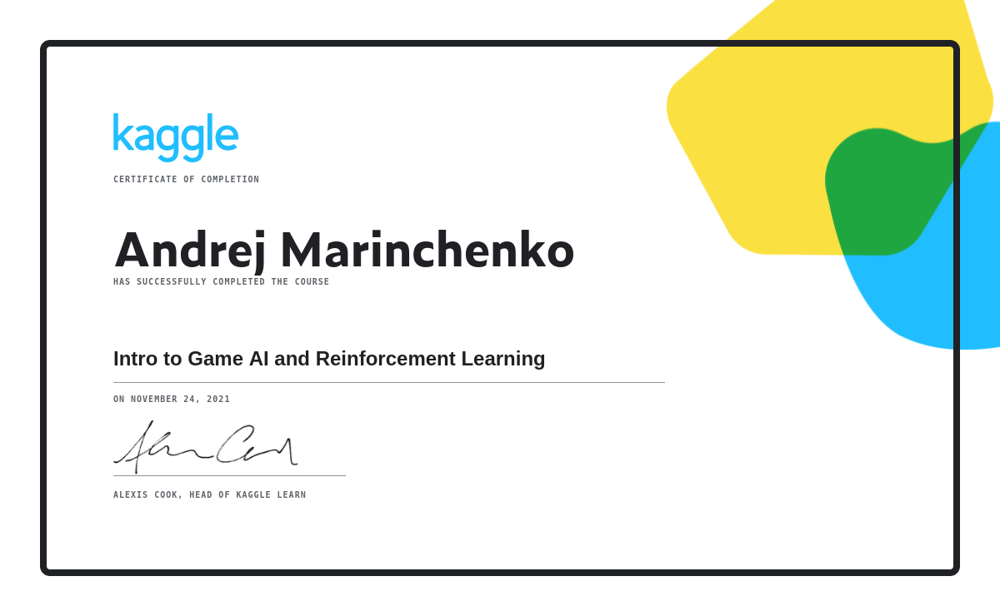
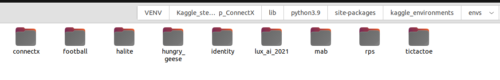
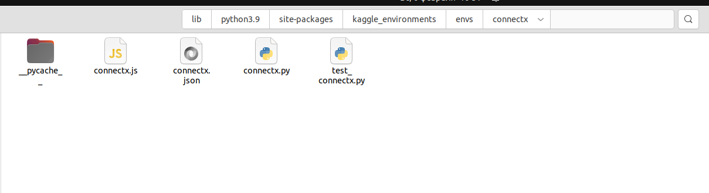
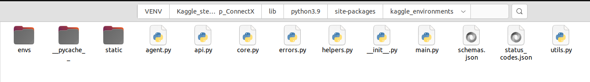
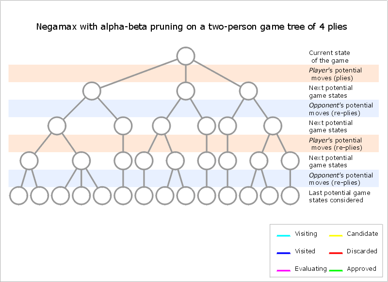

Всем привет, этот пост был написан мною после занятия лидирующей строчки в данном типе соревнований. Я прошел много 
обучающий курсов но именно тема симуляций мне понравилась больше всего и я решил поделится своими знаниями для тех 
кто захочет разобраться что это такое.  


###Вступление
Connect Four - это игра, в которой два игрока по очереди сбрасывают цветные диски в вертикальную сетку. Каждый 
 игрок использует свой цвет (обычно красный или желтый), и цель игры - первым получить четыре диска подряд (по 
вертикали, горизонтали или диагонали). Само соревнование Вы можете найти [здесь](https://www.kaggle.com/c/connectx).
С целью ознакомления и обучения на кагл имеется отдельный обучающий курс посвященный симуляторам и за 4 
теоритический занятия + 4 практических упражнения после каждого погрузит вас в этот мир, а по результатам Вам 
выдадут еще и сертификат вот такого образца:




#### „Если вы что-то не можете объяснить 6-летнему ребёнку, вы сами этого не понимаете.“ —  Альберт Эйнштейн
Я начинаю новый туториал для того что бы начинающему программисту, специалисту по машинному обучению было понятно 
даже без специфического образования о высшей математической базы. 

Если Вы скачали этот репозиторий следуя инструкции на главной [странице](../Readme.md) то все необходимые файлы у 
Вас уже есть, в том числе виртуальная среда каггл (kaggle_environments версии 0.1.6 или новее) с набором игр 
симуляций. На момент написания этого туториала 06.02.2022 актуальная версия kaggle_environments 1.8.12 и состоит из 
следующих игр.



Для тех кто хочет самостоятельно разворачивать виртуальную среду, можно ознакомится с его содержимым в репозитории 
[github](https://github.com/Kaggle/kaggle-environments) или сразу установить пакеты с помощью команды

```python
!pip install 'kaggle-environments>=0.1.6'
```
Задумывались ли Вы что означает эта строка?
Именно это строка в начале юпитер-ноутбука устанавливает необходимые пакеты. По факту осуществляя просто копирование 
в библиотеку вашего Python на ваш виртуальный компьютер ядра ноутбука. 


### Что такое виртуальная среда и зачем она нужна???
Цель соревнования - написать программу, которая выигрывает партию игры ConnectX. В этом курсе вы создадите 
собственных интеллектуальных агентов для игры. Результат вашей работы это отправка файла Python.py в котором 
прописан ваш натренированный на эту симуляцию агент. 
Таблица лидеров основана не на том, насколько точна ваша модель, или насколько верно она предскажет результат игры, 
а на том, насколько хорошо ваш агент выступил против агентов других пользователей. Т.е. ваше место на доске лидеров 
зарабатывает Ваша модель, при этом делает это постоянно играя 
с другими моделями, продвигаясь вверх (в случае выигрыша) и падая вниз в случае проигрыша. 

После того как мы произвели инсталяцию библиотеки виртуальной среды каггле в нашей игровой директории симулятора 
ConnectX 4 файла и еще одна папка `__pycache__` : 
```commandline
connectx.js
connectx.json
connectx.py
test_connectx.py
```



- файл `connectx.js` отвечает за прорисовку нашей игровой среды
- файл `connectx.json` отвечает за параметры нашей игровой среды:
    * количество игроков - 2, 
    * размер игрового поля - 7 на 6 ячеек, 
    * количество шаров которых необходимо выставить - 4, 
    * расположение шаров на предыдущем поле, 
    * время на ход - 2 секунды, 
    * метки проигрыш\ничья\победа - -1\0\1, 
    * заполнение игрового поля: 0 - пустая, 1 - шар игрока №1, 2 - шар игрока №2,
    * игра продолжается пока не победит один из игрока или не будут заполнены все поля.
- файл `connectx.py` отвечает за запуск первых двух файлов (прорисовку и получает параметры игрового процесса), 
   выполнение игры между двумя моделями, так же в нем по умолчанию прописаны две собственные простейшие моделей 
   (random_agent, negamax_agent). Здесь же применяются функции:
    * play - функция определения занятости позиций шарами на игровом поле;
    * is_win - функция определения победы (когда 4 шара выстроились в одну линию горизонтально, вертикально или по 
      диагонали);
    * interpreter - главная функции запускающая игровой процесс;
    * renderer - печать текущего игрового поля 
- файл `test_connectx.py` с набором тестовых функций игры;
- в папке `__pycache__`  находится кеш исполняемых файлов.

Мы перечислили только специфические файлы относящиеся только к одной игре `ConnectX` кроме них в корневом каталоге 
библиотеки виртуальной среды имеется еще 10 файлов относящихся к самой виртуальной среде.


- `__init__.py` - файл инициализации виртуальной среды (именно здесь прописана версия виртуальной среды, на 
  момент написания этого туториала 07.02.2022 версия "1.8.12") описываются параметры запуска виртуальной среды, 
  и через него идет обработка и запуск одной игры из набора, в нашем случае connectX);
- `main.py` - именно здесь обрабатываются входные параметры виртуальной среды (через парсер аргументов), и  
  осуществляется запуск;
- `core.py`- ядро нашей виртуальной среды, здесь указаны стартовые функции (register, evaluate, make и act_agent) а 
  также класс самой окружающей среды Environment. Строка `env = make("connectx", debug=False)` описана именно в этом 
  файле, первый параметр в скобках это название запускаемой игры, а второй режим отладки False - выключен, True - 
  включен означает выводить сообщение об ошибках или нет;
- `agent.py` - здесь описаны классы агентов (локального и веб-агента);
- `api.py` -  здесь описаны функции запроса с www.kaggle.com списка воспроизведения игр команды и эпизодов;
- `status_codes.json` - здесь описаны все ошибки при загрузке игровой модели;
- `errors.py` - обрабатывает значения ошибок из файла status_codes.json и выводит сообщение о соответствующем классе 
  ошибки;
- `helpers.py` - здесь описаны разные второстепенные функции, например преобразования значений множества в координаты 
  доски по оси х и у;
- `schemas.json` - здесь описаны основные параметры игрового процесса;
- `utils.py` - описание функций утилит применяемых в среде.

Кроме симулятора ConnectX в виртуальной среде кагл предусмотрено еще 8 симуляторов, итого 9, каждый находится в 
своей директории. Таким образом установив репозиторий виртуальной среды вы можете применять любой из 9 симуляторов.


#### Приступим к написанию нашего кода
Подключаем библиотеку  моделирования виртуальной среды kaggle_environments и ее функции make, evaluate, utils, agent

* функция `make` — создает окружение, сама функция прописанна в файле `core.py`
* функция `evaluate` — функция оценки и возврата награды за один или несколько эпизодов, прописана в файле `core.py`
* функция `utils` — описание функций утилит, используемых в среде, праписаны в файле `utils.py`
* функция `agent` - классы агентов (локальный и веб-агент) описаны в файле `agent.py`
```python
from kaggle_environments import make, evaluate, utils, agent  
```
Если вы видите сообщение об ошибке «Failed: football: No module named 'gfootball'», я рекомендую не обращать на 
это внимание, эта ошибка, безусловно, не имеет никакого смысла в отношении нашей среды ConnectX и в рамках этой 
симуляции она не будет нам мешать. Справедливости ради хочу отметить тот факт, что несмотря на жалобы на баг, это уже 
не первый раз, никаких существенных мер по его устранению не предпринималось. Где-то внутри перфекционист вопит о 
несовершенстве этой системы.    

```python
env = make("connectx")
```
Очень простой синтаксис, внутри функции указываем имя симулятора, для этого соревнования это ConnectX. 
Переменная ver и является нашей виртуальной средой. Несмотря на то что после запуска никаких визуальных изменений не 
произошло, мы уже создали экземпляр нашей виртуальной среды в которой и будем дальше применять нашего агента. 

```python
# Список доступных агентов по умолчанию, созданной вами среды env 
print(list(env.agents))
```
* «random» агент выбирает (равномерно) случайным образом из набора разрешенных ходов.
* Агент «negamax» представляет собой вариант упрощенной формы алгоритма минимаксного поиска. Вы можете найти более 
  подробную информацию [здесь](https://en.wikipedia.org/wiki/Negamax). если совсем просто, то это другой алгоритм 
  дерева поиска  



Алгоритм minmax в основном используется для игр, основанных на поиске соперника, что означает, что этот алгоритм 
более широко используется в играх, которые состоят из 2 игроков, например таких как 3 в ряд, шахматы, нарды и другие...
Этот алгоритм предлагает то, что на каждом ходу он оценивает из двух возможных интеркалированных решений, и 
выбирает то что наиболее выгодно в этой ситуации. Поскольку изучение всех возможных вариантов и определение  
следующего шага повлечет за собой большие затраты времени и места, 
что затрудняет обработку и вынуждает ограничить проводимый глубокий поиск.    

В ячейке кода ниже мы возьмем двух агентов, которые ходят всегда случайно, не осознанно, без оценки какой же ход 
сделать лучше в данной ситуации и пусть они играют пока один из них не выиграет этот раунд игры.
```python
# Два случайных агента играют в один игровой раунд
env.run(["random", "random"])  # Это строка кода запускает игру


env.render(mode="ipython")  #  это строка кода показывает игру в нашем ноутбуке, из этого можно сделать,  
                            #  вывод: игра состоится даже если этой строки кода не будет 
```

Вы можете воспользоваться встроенной функцией описания среды симуляции
