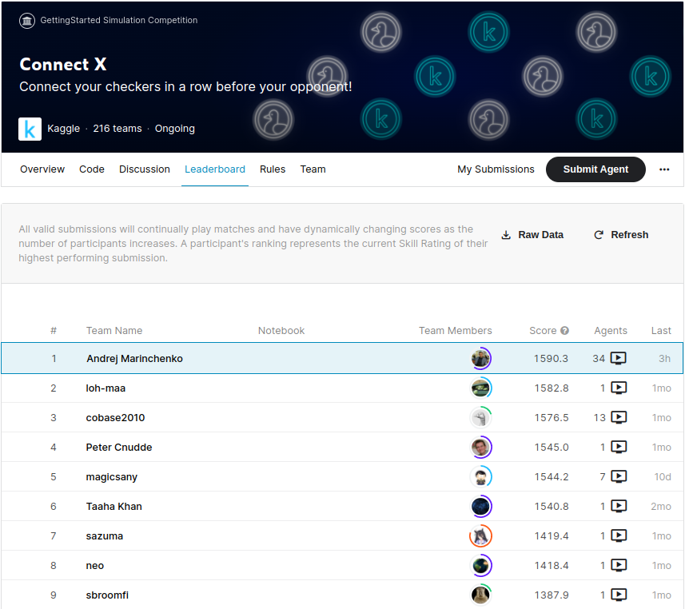
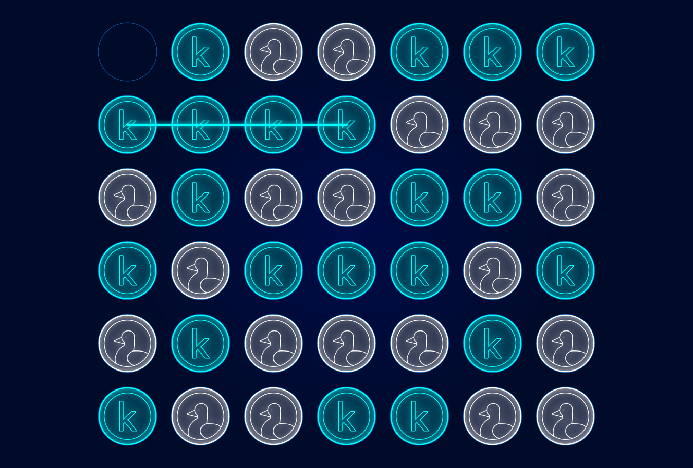

 
 


 
 


### Соревнование Kaggle ConnectX


  В этом проекте машинного обучения от kaggle нам нужно создать агент, который играет в игру ConnectX, используя
обучение с подкреплением. Агент принимает различные параметры, такие как размер доски, отметку, присвоенную
агент, текущая конфигурация доски и возвращает номер столбца, который он считает лучшим ходом
для игры. Затем каждый агент оценивается, играя с другими агентами, а затем ему присваивается уровень навыков.



### Цель этого туторила 
Цель - разабрать возможные подходы при работе с искуственным интелектом, научится работать с таким типом 
соревнований по машинному обучению под названием «Симуляции».

## Порядок установки и запуска                    
____
### Клонируем репозиторий
 
```sh
$ cmd
$ git clone https://github.com/BEPb/Kaggle_step_by_step_ConnectX
$ cd python-bot
```
 
### Устанавливаем необходимые пакеты
```sh
$    -r requirements.txt
```


### План туториала
1. [Знакомство со средой симуляции](01.step_01)
2. Простейший агент и процессы проходящие в этот момент
3. В разработке .....